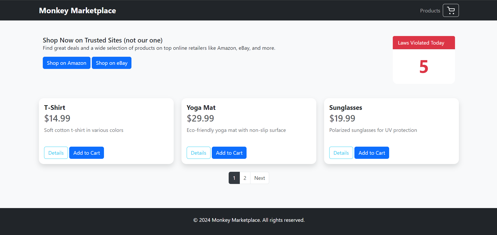
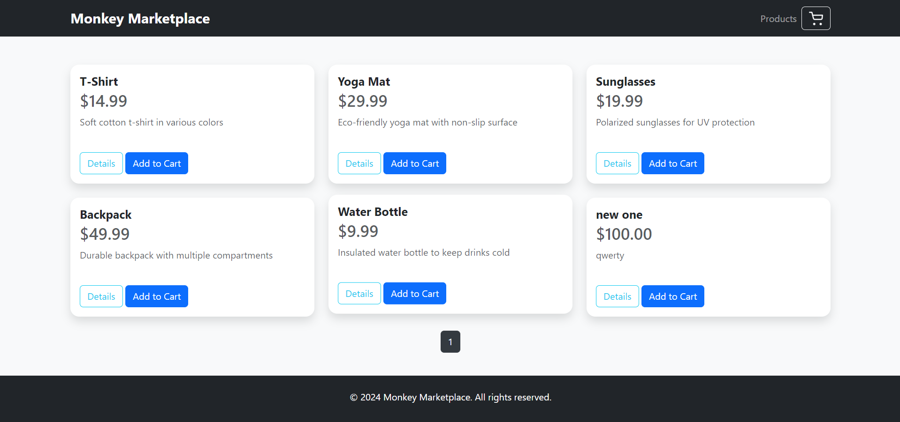
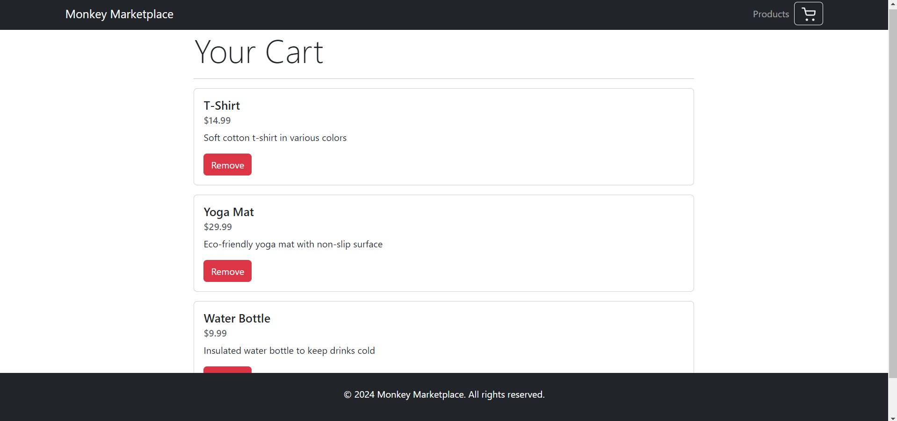

# E-commerce Website with Node.js, Express, and PostgreSQL (Monkey Marketplace)

## Overview
This is a simple e-commerce website that allows users to browse products. It uses Node.js, Express, and PosrgreSQL for the backend, and Bootstrap for the frontend.

## Getting Started

1. Clone this repository to your local machine: `git clone https://github.com/Maxrosoft/monkey-marketplace.git`
2. Install required packages: `npm install`
3. Start the server: `npm start`
4. Open a web browser and navigate to `http://localhost:3000/`

## Features

* Admin dashboard for product management
* Product catalog
* Shopping cart

## Screenshots

### Home Page

### Product Catalog

### Shopping Cart

## License

This project is licensed under the ISC License.

